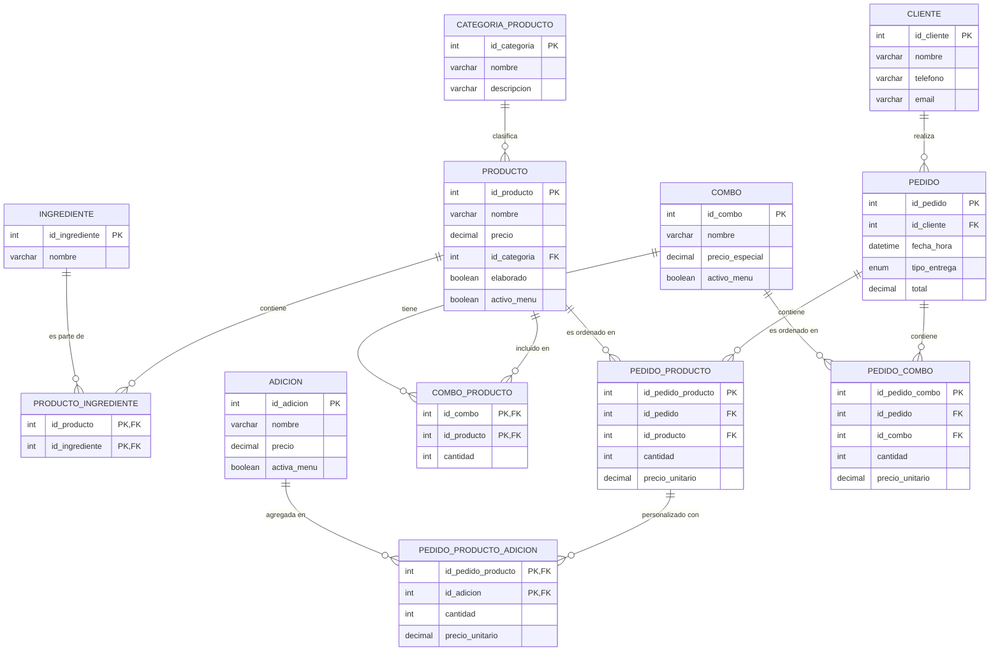
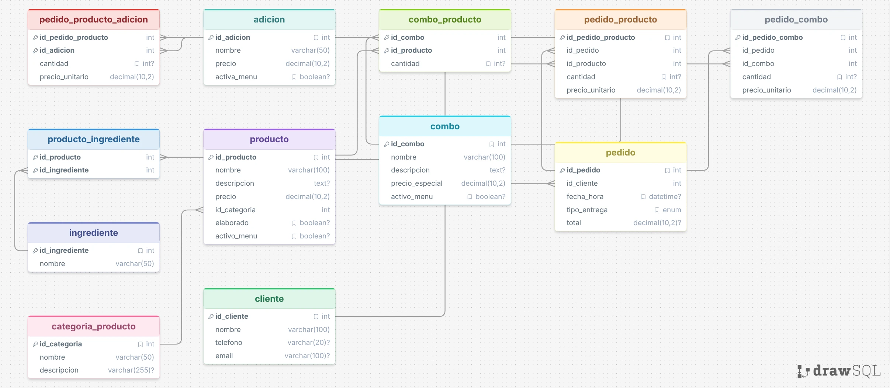

# Sistema de Gestión de Pizzería - Reto MySQL

## Descripción General del Proyecto

Este proyecto consiste en el diseño e implementación de una base de datos relacional en MySQL para gestionar de manera eficiente las operaciones de una pizzería. El sistema permite administrar productos (pizzas, panzarottis, bebidas, postres), ingredientes, adiciones, menús, combos, clientes y pedidos (tanto para consumo local como para recoger). 

La estructura está normalizada para asegurar la integridad referencial y facilitar la extracción de datos analíticos complejos sobre ventas, preferencias de clientes y popularidad de los productos.

## Diagrama Entidad-Relación (Modelo Lógico y Físico)
Hecho con una extension nativa de github, llamada mermaid


## Modelo físico
A continuacion se importa el modelo fisico realizado a traves de DrawSQl


## Modelo lógico

Asi mismo, se hace el analisis del modelo logico para determinar como funciona el sistema de esta base de datos:

## Instrucciones de Ejecución

Para ejecutar este proyecto en un entorno MySQL (como MySQL Workbench, phpMyAdmin, o consola), siga este orden estricto:

1. **Estructura de la Base de Datos:**
   Ejecute el archivo `01_Estructura_DDL.sql`. Este script creará la base de datos `pizzeria_db` junto con todas sus tablas, claves primarias y relaciones (claves foráneas).

2. **Inserción de Datos (DML):**
   Ejecute el archivo `02_Datos_DML.sql`. Este script poblará las tablas con datos realistas, incluyendo diferentes combinaciones de pedidos, combos y adiciones, necesarios para validar el funcionamiento de las consultas.

3. **Ejecución de Consultas:**
   Puede abrir y ejecutar las consultas alojadas en `03_Consultas_DQL.sql` para comprobar los análisis de datos de la pizzería.

## Consultas Solicitadas y Lógica Implementada

A continuación se detallan las 20 consultas solicitadas, con una explicación de la lógica utilizada en cada una de ellas para extraer la información.

### 1. Productos más vendidos
**Lógica:** Usamos un `CTE` (Common Table Expression) llamado `ProductosVendidos` con `UNION ALL` para unificar la cantidad de productos vendidos de manera individual (`pedido_producto`) con la cantidad de productos vendidos dentro de los combos (`pedido_combo` multiplicado por la cantidad de ese producto en el combo). Luego se agrupa por nombre y se suma.
```sql
WITH ProductosVendidos AS (
    SELECT id_producto, cantidad FROM pedido_producto
    UNION ALL
    SELECT cp.id_producto, (pc.cantidad * cp.cantidad) AS cantidad
    FROM pedido_combo pc
    JOIN combo_producto cp ON pc.id_combo = cp.id_combo
)
SELECT p.nombre, SUM(pv.cantidad) as total_vendidos
FROM ProductosVendidos pv
JOIN producto p ON pv.id_producto = p.id_producto
GROUP BY p.nombre
ORDER BY total_vendidos DESC;
```

### 2. Total de ingresos generados por cada combo
**Lógica:** Multiplicamos la cantidad de combos ordenados en la tabla `pedido_combo` por su `precio_unitario` al momento de la venta, agrupando los resultados por el nombre del combo.
```sql
SELECT c.nombre, SUM(pc.cantidad * pc.precio_unitario) as total_ingresos
FROM pedido_combo pc
JOIN combo c ON pc.id_combo = c.id_combo
GROUP BY c.nombre;
```

### 3. Pedidos realizados para recoger vs. comer en la pizzería
**Lógica:** Realizamos un conteo `COUNT(*)` agrupando por el campo `tipo_entrega` de la tabla `pedido`.
```sql
SELECT tipo_entrega, COUNT(*) as total_pedidos
FROM pedido
GROUP BY tipo_entrega;
```

### 4. Adiciones más solicitadas en pedidos personalizados
**Lógica:** Sumamos la cantidad de adiciones en la tabla intermedia `pedido_producto_adicion`, hacemos un `JOIN` con la tabla `adicion` para obtener el nombre, y agrupamos ordenando de mayor a menor.
```sql
SELECT a.nombre, SUM(ppa.cantidad) as veces_solicitada
FROM pedido_producto_adicion ppa
JOIN adicion a ON ppa.id_adicion = a.id_adicion
GROUP BY a.nombre
ORDER BY veces_solicitada DESC;
```

### 5. Cantidad total de productos vendidos por categoría
**Lógica:** Reutilizamos la lógica del CTE de la consulta 1 para unificar las ventas (individuales y en combo). Luego, unimos la tabla de `producto` y `categoria_producto` para agrupar las ventas totales por el nombre de la categoría.
```sql
WITH ProductosVendidos AS (
    SELECT id_producto, cantidad FROM pedido_producto
    UNION ALL
    SELECT cp.id_producto, (pc.cantidad * cp.cantidad) AS cantidad
    FROM pedido_combo pc
    JOIN combo_producto cp ON pc.id_combo = cp.id_combo
)
SELECT c.nombre as categoria, SUM(pv.cantidad) as total_vendidos
FROM ProductosVendidos pv
JOIN producto p ON pv.id_producto = p.id_producto
JOIN categoria_producto c ON p.id_categoria = c.id_categoria
GROUP BY c.nombre
ORDER BY total_vendidos DESC;
```

### 6. Promedio de pizzas pedidas por cliente
**Lógica:** Calculamos la cantidad total de pizzas ordenadas (filtrando la categoría 'Pizza' tanto en ventas individuales como en combos). Dividimos esta suma total por el número de clientes registrados en la base de datos para obtener el promedio per cápita.
```sql
WITH PizzasVendidas AS (
    SELECT p.id_cliente, pp.cantidad
    FROM pedido_producto pp
    JOIN pedido p ON pp.id_pedido = p.id_pedido
    JOIN producto prod ON pp.id_producto = prod.id_producto
    JOIN categoria_producto cat ON prod.id_categoria = cat.id_categoria
    WHERE cat.nombre = 'Pizza'
    UNION ALL
    SELECT p.id_cliente, (pc.cantidad * cp.cantidad) AS cantidad
    FROM pedido_combo pc
    JOIN pedido p ON pc.id_pedido = p.id_pedido
    JOIN combo_producto cp ON pc.id_combo = cp.id_combo
    JOIN producto prod ON cp.id_producto = prod.id_producto
    JOIN categoria_producto cat ON prod.id_categoria = cat.id_categoria
    WHERE cat.nombre = 'Pizza'
)
SELECT SUM(cantidad) / (SELECT COUNT(id_cliente) FROM cliente) as promedio_pizzas_por_cliente
FROM PizzasVendidas;
```

### 7. Total de ventas por día de la semana
**Lógica:** Extraemos el día de la semana de la `fecha_hora` del pedido usando la función `DAYNAME()`, y agrupamos la suma del `total` facturado por ese día.
```sql
SELECT DAYNAME(fecha_hora) as dia_semana, SUM(total) as total_ventas
FROM pedido
GROUP BY dia_semana
ORDER BY total_ventas DESC;
```

### 8. Cantidad de panzarottis vendidos con extra queso
**Lógica:** Realizamos `JOIN` entre las tablas de pedidos, productos (filtrando por categoría 'Panzarotti') y adiciones del pedido (filtrando por 'Extra Queso'), sumando finalmente la cantidad de productos de esa relación.
```sql
SELECT SUM(pp.cantidad) as panzarottis_extra_queso
FROM pedido_producto pp
JOIN producto p ON pp.id_producto = p.id_producto
JOIN categoria_producto cp ON p.id_categoria = cp.id_categoria
JOIN pedido_producto_adicion ppa ON pp.id_pedido_producto = ppa.id_pedido_producto
JOIN adicion a ON ppa.id_adicion = a.id_adicion
WHERE cp.nombre = 'Panzarotti' AND a.nombre = 'Extra Queso';
```

### 9. Pedidos que incluyen bebidas como parte de un combo
**Lógica:** Buscamos los ID de pedido distintos en la tabla `pedido_combo` que estén vinculados a un combo que, a su vez, contenga un producto cuya categoría sea 'Bebida'.
```sql
SELECT DISTINCT pc.id_pedido
FROM pedido_combo pc
JOIN combo_producto cp ON pc.id_combo = cp.id_combo
JOIN producto p ON cp.id_producto = p.id_producto
JOIN categoria_producto cat ON p.id_categoria = cat.id_categoria
WHERE cat.nombre = 'Bebida';
```

### 10. Clientes que han realizado más de 5 pedidos en el último mes
**Lógica:** Agrupamos los pedidos por cliente, filtrando aquellos cuya fecha sea mayor o igual a hace un mes (`DATE_SUB(NOW(), INTERVAL 1 MONTH)`). Se usa `HAVING` para filtrar los clientes con más de 5 pedidos en ese lapso.
```sql
SELECT c.nombre, COUNT(p.id_pedido) as total_pedidos
FROM cliente c
JOIN pedido p ON c.id_cliente = p.id_cliente
WHERE p.fecha_hora >= DATE_SUB(NOW(), INTERVAL 1 MONTH)
GROUP BY c.id_cliente
HAVING total_pedidos > 5;
```

### 11. Ingresos totales generados por productos no elaborados
**Lógica:** Sumamos el subtotal (`cantidad * precio_unitario`) en la tabla `pedido_producto` exclusivamente para los productos cuya bandera `elaborado` es igual a 0 (bebidas, postres empacados). *Nota: Los ingresos por combos no se dividen por producto, por lo que aquí medimos ventas individuales.*
```sql
SELECT SUM(pp.cantidad * pp.precio_unitario) as ingresos_no_elaborados
FROM pedido_producto pp
JOIN producto p ON pp.id_producto = p.id_producto
WHERE p.elaborado = 0;
```

### 12. Promedio de adiciones por pedido
**Lógica:** Sumamos la cantidad total de adiciones aplicadas en `pedido_producto_adicion` y la dividimos por la cantidad total de pedidos históricos en la tabla `pedido`.
```sql
SELECT SUM(cantidad) / (SELECT COUNT(id_pedido) FROM pedido) as promedio_adiciones_por_pedido
FROM pedido_producto_adicion;
```

### 13. Total de combos vendidos en el último mes
**Lógica:** Sumamos la cantidad vendida en la tabla `pedido_combo`, haciendo JOIN con `pedido` para filtrar únicamente los realizados durante el último mes.
```sql
SELECT SUM(pc.cantidad) as total_combos_mes
FROM pedido_combo pc
JOIN pedido p ON pc.id_pedido = p.id_pedido
WHERE p.fecha_hora >= DATE_SUB(NOW(), INTERVAL 1 MONTH);
```

### 14. Clientes con pedidos tanto para recoger como para consumir en el lugar
**Lógica:** Agrupamos por cliente y utilizamos una condición `HAVING` apoyada en sentencias `CASE`. Si la suma de casos donde el pedido fue 'Recoger' es mayor a 0 y la suma donde fue 'Local' es mayor a 0, el cliente cumple el requisito.
```sql
SELECT c.nombre
FROM cliente c
JOIN pedido p ON c.id_cliente = p.id_cliente
GROUP BY c.id_cliente
HAVING SUM(CASE WHEN p.tipo_entrega = 'Recoger' THEN 1 ELSE 0 END) > 0
   AND SUM(CASE WHEN p.tipo_entrega = 'Local' THEN 1 ELSE 0 END) > 0;
```

### 15. Total de productos personalizados con adiciones
**Lógica:** Contamos de forma única (`COUNT(DISTINCT)`) los registros `id_pedido_producto` que figuran en la tabla `pedido_producto_adicion`, esto nos indica cuántos productos individuales dentro de los pedidos sufrieron modificaciones.
```sql
SELECT COUNT(DISTINCT id_pedido_producto) as total_productos_personalizados
FROM pedido_producto_adicion;
```

### 16. Pedidos con más de 3 productos diferentes
**Lógica:** Extraemos los IDs de productos únicos de `pedido_producto` y los unimos (`UNION`) con los productos de los combos de ese pedido. Luego agrupamos por pedido y filtramos con `HAVING` aquellos que tengan más de 3 productos distintos.
```sql
SELECT id_pedido, COUNT(DISTINCT id_producto) as productos_diferentes
FROM (
    SELECT id_pedido, id_producto FROM pedido_producto
    UNION
    SELECT pc.id_pedido, cp.id_producto 
    FROM pedido_combo pc
    JOIN combo_producto cp ON pc.id_combo = cp.id_combo
) as productos_por_pedido
GROUP BY id_pedido
HAVING productos_diferentes > 3;
```

### 17. Promedio de ingresos generados por día
**Lógica:** Creamos una subconsulta que agrupa la suma de los totales de los pedidos por fecha (`DATE(fecha_hora)`). Luego calculamos el promedio (`AVG`) de esos ingresos diarios en la consulta principal.
```sql
SELECT AVG(ingreso_diario) as promedio_ingresos_dia
FROM (
    SELECT DATE(fecha_hora) as dia, SUM(total) as ingreso_diario
    FROM pedido
    GROUP BY DATE(fecha_hora)
) as ingresos_por_dia;
```

### 18. Clientes que han pedido pizzas con adiciones en más del 50% de sus pedidos
**Lógica:** Utilizamos un `CTE` para identificar qué pedidos específicos incluyen pizzas modificadas con adiciones. Luego, un segundo `CTE` agrupa por cliente para contar su total de pedidos y cuántos de esos pertenecen a la lista anterior. Finalmente, filtramos los clientes donde los pedidos modificados superan el 50% (`total_pedidos * 0.5`).
```sql
WITH PedidosPizzaAdicion AS (
    SELECT DISTINCT p.id_pedido, p.id_cliente
    FROM pedido p
    JOIN pedido_producto pp ON p.id_pedido = pp.id_pedido
    JOIN producto prod ON pp.id_producto = prod.id_producto
    JOIN categoria_producto cat ON prod.id_categoria = cat.id_categoria
    JOIN pedido_producto_adicion ppa ON pp.id_pedido_producto = ppa.id_pedido_producto
    WHERE cat.nombre = 'Pizza'
),
EstadisticasCliente AS (
    SELECT 
        c.id_cliente,
        c.nombre,
        COUNT(DISTINCT p.id_pedido) as total_pedidos,
        COUNT(DISTINCT ppa.id_pedido) as pedidos_pizza_adicion
    FROM cliente c
    JOIN pedido p ON c.id_cliente = p.id_cliente
    LEFT JOIN PedidosPizzaAdicion ppa ON p.id_pedido = ppa.id_pedido
    GROUP BY c.id_cliente
)
SELECT nombre, total_pedidos, pedidos_pizza_adicion
FROM EstadisticasCliente
WHERE pedidos_pizza_adicion > (total_pedidos * 0.5);
```

### 19. Porcentaje de ventas provenientes de productos no elaborados
**Lógica:** Calculamos la suma condicional: si el producto es no elaborado (`elaborado = 0`), acumulamos su ingreso. Dividimos esto entre el `total` sumado de todos los pedidos y lo multiplicamos por 100.
```sql
SELECT 
    (SUM(CASE WHEN p.elaborado = 0 THEN pp.cantidad * pp.precio_unitario ELSE 0 END) / 
    (SELECT SUM(total) FROM pedido)) * 100 as porcentaje_no_elaborados
FROM pedido_producto pp
JOIN producto p ON pp.id_producto = p.id_producto;
```

### 20. Día de la semana con mayor número de pedidos para recoger
**Lógica:** Filtramos los pedidos con `tipo_entrega = 'Recoger'`, agrupamos por el día de la semana (`DAYNAME()`), contamos los registros, ordenamos de forma descendente y limitamos a 1 registro (`LIMIT 1`).
```sql
SELECT DAYNAME(fecha_hora) as dia_semana, COUNT(*) as total_recoger
FROM pedido
WHERE tipo_entrega = 'Recoger'
GROUP BY dia_semana
ORDER BY total_recoger DESC
LIMIT 1;
```
